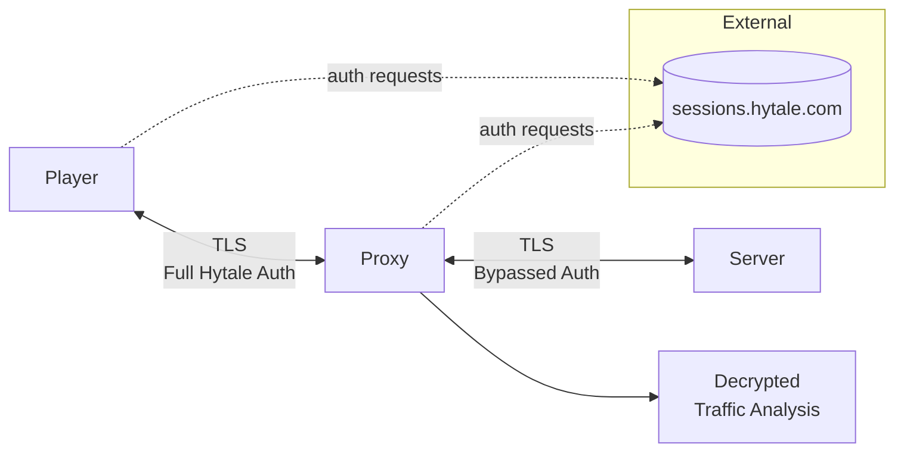
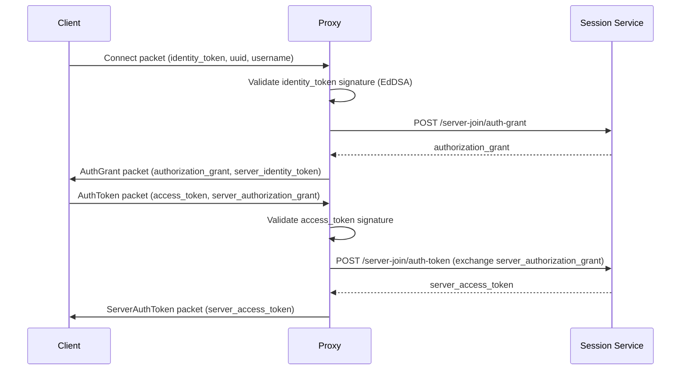
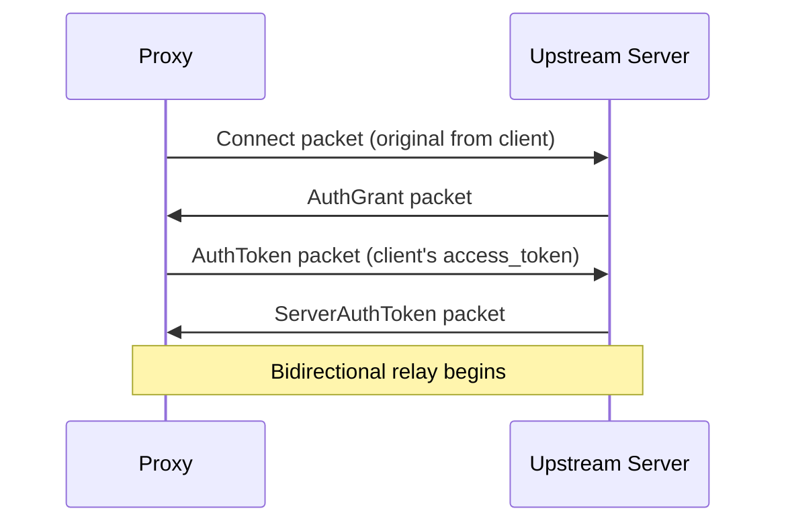

# Armadillo Proxy

Armadillo is a QUIC, TLS-terminating, proxy that sits between Hytale clients and servers, handling authentication on behalf of the server. Allowing full visibility into the contents.



## Quick Start

Build and install the server plugin:

```bash
cd plugin
./gradlew build
cp build/libs/offline-mode-0.1.0.jar /path/to/server/mods/
```

Build the proxy:

```bash
cargo build --release
```

Run the proxy (requires `auth.enc` from a Hytale client):

```bash
./target/release/armadillo --listen 0.0.0.0:5520 --upstream 127.0.0.1:5521
```

Point your client to the proxy address. The server should listen on the upstream port with the plugin loaded.

## Why?

First, because it's fun. Second, it's a good starting point for those looking into how to extend the server.

Hytale uses QUIC, which in turn uses TLS 1.3. This version of TLS comes with perfect forward secrecy out of the box, making it impossible to eavesdrop a communication
between peers without actively participating. If you try simply terminating the TLS, the Hytale server will notice your certificate does not match the player's you
are connecting on behalf.

Luckily, we are in Java-land. A simple mod (plugin) is enough to patch the server in a way to bypass the certificate validation. By using reflection in 3 specific
points, the server allows unauthenticated players to join:
* By overriding the logic in `JWTValidator`, we can still parse relevant token information without validatin the player's certificate
* A patch to `SessionServiceClient` allows us to avoid requests to Hytale's servers
* Inserting a fake game session to `ServerAuthManager` avoid a set of other requests

<video src="https://github.com/user-attachments/assets/5bb292a4-e21b-4e46-9295-5a20fc911d77" controls preload></video>

### Player -> Proxy

The proxy validates JWT tokens using EdDSA (Ed25519) signatures. Public keys are fetched from the session service's JWKS endpoint and cached. This is the same process handled by the server JAR.



### Proxy -> Server

The patched server ignores all validation and only extracts the necessary information from the client's token. After authentication is done, traffic can be relayed.



## Packet Structure

All packets use a simple framing format:

| Field | Size | Description |
|-------|------|-------------|
| length | 4 bytes (LE) | Payload length |
| id | 4 bytes (LE) | Packet type ID |
| payload | variable | Packet-specific data |

## The auth.enc file

Credentials are encrypted with AES-256-GCM. The key is derived from the machine's hardware UUID using PBKDF2-HMAC-SHA256 (100k iterations, salt: `HytaleAuthCredentialStore`).

#### Encrypted file format

| Offset | Size | Content |
|--------|------|---------|
| 0 | 12 | Nonce/IV |
| 12 | rest | Ciphertext + GCM tag |

#### Decrypted file format

| Offset | Size | Content |
|--------|------|---------|
| 0 | 4 | Header (zeros) |
| 4+ | var | Field entries (repeated) |

Each entry:

| Size | Content |
|------|---------|
| 1 | Separator (0x00) |
| var | Key name (null-terminated) |
| 4 | Value length (LE u32) |
| var | Value bytes |

And the fields: `AccessToken`, `RefreshToken`, `ExpiresAt`, `ProfileUuid`
